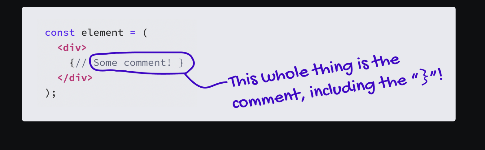

# Understanding JSX 

#### Q1:Paint to the DOM "Hello World!" using JSX 

**Answer**:

Index.js

```js
import React from 'react';
import { createRoot } from 'react-dom/client';

const element = (

  <p id="hello">
    Hello World!
  </p>

);

const container = document.querySelector('#root');
const root = createRoot(container);
root.render(element);


```

Index.html

```html
<html>
<body>

  <div id="root"></div>

</body>
</html>
```

In the example above, we wrap the JSX in parentheses, like this:

```jsx
const element = (

  <p id="hello">
    Hello World!
  </p>

);
```

This is done purely for formatting purposes. It allows us to push the JSX onto the next line.

#### Q2:What is transpiling ? 

**Answer** : transpiling is the process of converting a higher level language to another higher level language , like the process of converting JSX to JS is called transpiling 

#### Q3:Can browsers understand JSX ? 

**Answer**: 

If we try to run this JSX code in the browser, we'll get an error. JavaScript engines don't understand JSX, they only understand JavaScript. And so we need to transpire  our code into plain JS.

This is most commonly done as part of a build step, using a tool like Babel

The JSX we write gets converted into `React.createElement`. By the time our code is running in the user's browser, all of the JSX has been zapped out, and we're left with a JS file full of nested `React.createElement` calls. 

#### Q4:Can a js file contain JSX ? 

**Answer**:

In the early days of React, any file that included JSX had to use the `.jsx` file extension. This was how we told the compiler: “Hey! This file has some JSX in it, and needs to be compiled to JS.”

This turned out to be a bit annoying. It was one more thing to think about, one more bit of friction in the development process. Having to rename a file whenever we add/remove JSX is a bit of a pain!

And so, the rules were loosened. These days, we can include JSX in a `.js` file, and everything will work perfectly*. Compilers assume that any `.js` file can contain JSX.

#### Q5: What is JSX transformer and why did React Team came up with JSX transformer in React 17 ?

**Answer**:

Let's look again at this code snippet:

```jsx
import React from 'react';
import { createRoot } from 'react-dom/client';

const element = (
  <p id="hello">
    Hello World!
  </p>
);

const container = document.querySelector('#root');
const root = createRoot(container);
root.render(element);
```

On the very first line, we're importing `React`, but we aren't actually using it anywhere… Are we? Can we omit it?

After we compile away the JSX, we're left with the following code:

```js
import React from 'react';

import { createRoot } from 'react-dom/client';

const element = React.createElement(

  'p',

  { id: 'hello' },

  'Hello World!'

);

const container = document.querySelector('#root');

const root = createRoot(container);

root.render(element);
```

When the JSX is compiled into plain JS, the dependency makes itself clear. That `<p>` tag becomes a `React.createElement` call! It's obfuscated? by the JSX.

In earlier versions of React, you'd get an error if you forgot to include the React import:


This was such a common stumbling block for beginners that the React team decided to spend some time seeing how they could improve things. And they came up with a pretty clever solution!

With React 17, the React team introduced a new “JSX transformer”, used by Babel and other compilers. Essentially, it *automatically injects the import* during the build process.

For example, let's suppose we had this code:

```js
const element = (
  <p id="hello">
    Hello World!
  </p>
);
```

Using the modern JSX transformer, it will get compiled to:

```js
import { jsx as _jsx } from 'react/jsx-runtime';


const element = _jsx(

  'p',

  { id: 'hello' },

  'Hello World!'

);
```

Note that our original code *didn't* include that import statement. It was included automatically by the compiler.

`_jsx` is a fancy optimized version of `React.createElement`. It includes some shortcuts when we use certain React features like Fragments or Portals. Otherwise, it does the exact same thing as `React.createElement`: it creates a React element.

And so, these days, we *don't* have to import React. The JSX compiler will solve this problem for us.

#### Q6: js inside JSX 

Fill in the blanks 

In JSX, the content we put between open/close tags is treated as a __________. If we try and reference a variable, it'll ____________________

We can create *expression slots* with curly brackets (__).   Anything _________

Because JSX turns into `React.createElement()` function calls, we'll get a JavaScript syntax error if we try and place a ___________

**Answer**:

In JSX, the content we put between open/close tags is treated as a static string. If we try and reference a variable, it'll print the variable name itself, rather than the value it references.

We can create *expression slots* with curly brackets (`{}`). Anything placed in-between curly brackets will be treated as pure JavaScript, instead of a string.

There aren't a lot of rules when it comes to JSX. The compilation process doesn't check if it's even valid! It's the messenger; it forwards the content along to the pure JS output.

Because JSX turns into `React.createElement()` function calls, we'll get a JavaScript syntax error if we try and place a statement in that slot. It has to be an *expression*.

```js
import React from 'react';
import { createRoot } from 'react-dom/client';

const shoppingList = ['apple', 'banana', 'carrot'];

// This code...
const element = (

  <div>
    Items left to purchase: {shoppingList.length}
  </div>

);

// ...is equivalent to this code:
const compiledElement = React.createElement(
  'div',
  {},
  'Items left to purchase: ',
  shoppingList.length
);

const container = document.querySelector('#root');
const root = createRoot(container);
root.render(element);
```

#### Q7:How to add comments within jsx ? 

**Answer**:

To add a comment in JSX, we use an expression slot:

```jsx
const element = (
  <div>
    {/* Some comment! */}
  </div>
);
```

We specifically need to use the multi-line comment syntax (`/* */`) instead of the single-line syntax (`//`). This is because the single-line syntax comments *everything* out, including the closing `}` for the expression slot!



#### Q8:How can we add dynamic attribute values in jsx ? 

**Answer**:

```js
const uniqueId = 'content-wrapper';

const element = (
  <main id={uniqueId}>
    Hello World
  </main>
);
```

The squiggly brackets (`{}`) allow us to create an *expression slot*. This time, we're creating a slot for the value of the `id` attribute.

#### Q9:What is the distinction between *compile-time* (the code processing that happens before the code runs in the browser) and *run-time* (the code execution that happens in the browser).

**Answer**:

```js
const userEmail = 'sumeet@thegreat.com';

const element = (
  <main id={userEmail.replace('@', '-')}>
    Hello World
  </main>
);

// Will get compiled as:
const compiledElement = React.createElement(
  'main',
  {
    id: userEmail.replace('@', '-'),
  },
  'Hello World'
);
```

**Note that when we compile the code, it doesn't actually get \*evaluated\*.** We've written some logic which will turn that `userEmail` string into `"sumeet-thegreat.com"`, replacing the `@` character with a `-`, but that only happens when we *run* the code.

When JSX gets compiled to JS, we copy over everything between the `{` and `}`. We don't call any functions or run any of the logic. That happens later, when the processed JavaScript runs in the browser.

This is the distinction between *compile-time* (the code processing that happens before the code runs in the browser) and *run-time* (the code execution that happens in the browser).


#### Q10:"At run-time, React will automatically convert types as needed when supplying attributes in expression slots."

Is the above statement true ? 

**Answer**:

At run-time, React will automatically convert types as needed when supplying attributes in expression slots.

For example, these two elements are identical:

```jsx
// This works:
<input required="true" />


// And so does this!
<input required={true} />
```

In the first example, we're setting the `required` attribute equal to the string `"true"`. In the second example, it's equal to the *boolean* attribute `true`. In HTML, values must be strings, and so the boolean `true` is converted to the string `"true"`.

Similarly, we can pass either numbers or strings for numeric attributes:

```jsx
// ✅ Valid
<input type="range" min="1" max="20" />
// ✅ Valid
<input type="range" min={1} max={20} />
```

#### Q11:In HTML, it's possible to set attributes to `true` by specifying only the key, like this:

```html
<input required>
```

Then why is this  not recommend ?

```jsx
<input required />
<input required={true} />
```

 **Solution**:

In HTML, it's possible to set attributes to `true` by specifying only the key, like this:

```html
<input required>
```

This same pattern has been implemented in JSX; these two elements are equivalent:

```jsx
<input required />
<input required={true} />
```

Honestly, though, **it not recommend doing this.** its recommended to spell it out, and write `required={true}`

To understand why, I think it's worth considering what it means in JavaScript when we supply only the key, and not the value.

For example:

```js
const name = 'Spot';
const dog = { name };


console.log(dog);
→ { name: 'Spot' }
```

When it comes to JavaScript objects, `{ name }` is equivalent to `{ name: name }`, and not `{ name: true }`.

JSX is a bit of a hybrid between HTML and JS, and so it can be ambiguous  for new developers. If you're looking at JSX through an HTML lens, you'd expect the value to be `true`, but if you look at it through a JavaScript lens, you'd expect the value to be equal to the key.

In fact, there was even some talk about deprecating the “attribute-only”  syntax in JSX, to remove this ambiguity. In the end, the team decided to keep it for now, but it wouldn't be a surprise  if this was removed in the future.

And so, to keep things as simple and future-proof as possible, we choose to write the full thing out, `required={true}`.

#### Q12:Differences between HTML and JSX 

**Answer**:

1. **Reserved Keywords** : Because JSX gets transformed into JS, we can't use any reserved words of JS in our JSX

- `for` is changed to `htmlFor`
- `class` is changed to `className`

```html
const element = (
  <div>
    <label for="name">
      Name:
    </label>
    <input
      id="name"
      class="fun-input"
    />
  </div>
);
```

​	To make the above conversion in JSX we do the following : 

```jsx
const element = (
  <div>
    <label htmlFor="name">
      Name:
    </label>
    <input
      id="name"
      className="fun-input"
    />
  </div>
);
```

Note => To be a bit more specific: `for` and `class` work fine when we use them on *native* HTML elements, but we run into problems if we try and use them on custom components.

2. We absolutely need to close every tag we open in JSX

The following is perfectly valid in HTML 

```html
<div>
  <p>This paragraph is opened… but never closed.
  <p>We're omitting the closing tags!
</div>
```

 Equivalent in JSX : 

```jsx
const element = (
  <div>
    <p>These paragraphs are valid.</p>
    <p>They include the closing tags.</p>
  </div>
);
```

3. HTML elements like `img` which doesnt have self closing tags must be closed in JSX 

Perfectly valid in HTML 

```html

```

Equivalent in JSX : 

```jsx
const element = (
  
);
```

4. HTML can be written in uppercase whereas JSX must be written in small case 

Perfectly valid in HTML 

```html
<MAIN>
  <HEADER>
    <H1>Hello World!</H1>
  </HEADER>
  <P>
    This HTML is so loud!
  </P>
</MAIN>
```

Equivalent in JSX 

```jsx
const element = (
  <main>
    <header>
      <h1>Hello World!</h1>
    </header>
    <p>
      This HTML is so loud!
    </p>
  </main>
);
```

Reason : JSX compiler uses the tag's case to tell whether it's a "primitive" (part of the DOM) or a custom component.

5. Attributes must be camelCase in JSX 

Valid HTML 

```html
<video
  src="/videos/cat-skateboarding.mp4"
  autoplay="true"
>
```

In JSX, we need to capitalize the “p” in “autoplay”, since “auto” and “play” are distinct words:

```jsx
const element = (
  <video
    src="/videos/cat-skateboarding.mp4"
    autoPlay={true}
    //  ^ Capital “P”
  />
);
```

We've also switched to use an expression slot, `{true}`, instead of keeping it as a string. This is slightly more idiomatic in React, although both options will work

Other properties that need to be "camelCased" include:

`onclick` → `onClick`

`tabindex` → `tabIndex`

`stroke-dasharray` → `strokeDasharray` (this one is specific for SVGs)

Note : **Data and ARIA attributes keep their dashes  **

There are two exceptions to the "camelCasing" of attributes: data attributes and ARIA attributes.

For example, this is valid JSX:

```jsx
const element = (
  <button
    data-test-id="close-dialog-button"
    aria-label="Close dialog"
  >
    
  </button>
);
```

Data attributes aren't used *that* often in React, but they can  be helpful for labelling elements for automated testing. ARIA attributes are used by assistive technologies like screen readers to improve the  accessibility of our applications.

6. CSS differences 

In HTML, the `style` attribute allows us to apply some styles inline, to a specified element:

```html
<h1 style="font-size: 2rem;">
  Hello World!
</h1>
```

In JSX, `style` instead takes an object:

```jsx
const element = (
  <h1 style={{ fontSize: '2rem' }}>
    Hello World!
  </h1>
);
```

Note :  for `style`, we want to pass an object containing the CSS properties we want to set, and their values thats why we need to pass an object 

All CSS properties are written in “camelCase”. Every dash is replaced by capitalizing the subsequent word:

background-position` becomes `backgroundPosition

`border-bottom-color` becomes `borderBottomColor`

For vendor prefixes like `-webkit-font-smoothing`, we capitalize the first letter as well: `**W**ebkitFontSmoothing`.

Also, React will automatically apply the `px` suffix for certain CSS properties. For example:

```jsx
<div
  style={{
    width: 200, // Equivalent to `width: 200px`
    paddingTop: 8, // Equivalent to `padding-top: 8px`
  }}
>
```

Watch out for properties that take a unitless value by default, like `flex` or `lineHeight`.

For example, this code will produce lines that are *twenty times taller* than default, not lines that are 20px tall:

```jsx
<p
  style={{
    lineHeight: 20, // Equivalent to `line-height: 20`
  }}
>
```

While it's a common convention in React to use unitless values where possible, you can absolutely use full units if you prefer!

```jsx
<p
  style={{
    width: '200px',
    paddingTop: '8px',
  }}
>
```